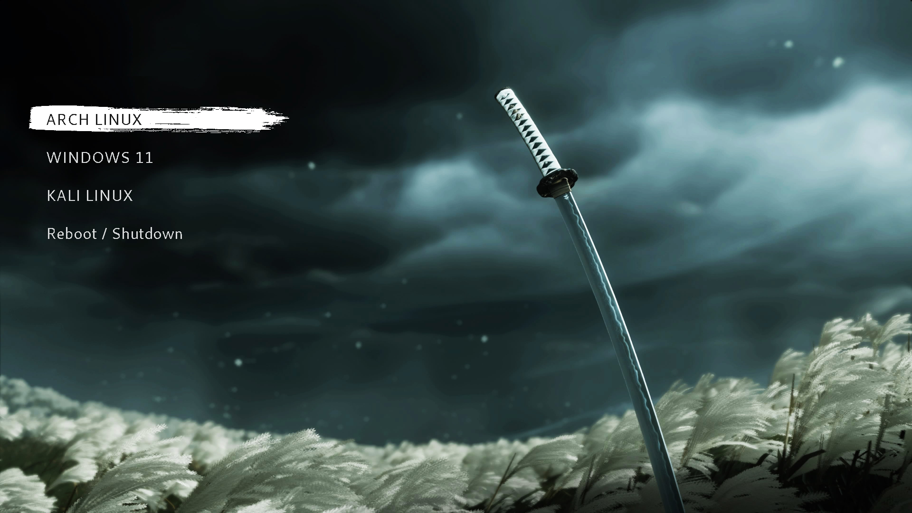

# grub-of-tsushima

A GRUB2 bootloader theme inspired by **Ghost of Tsushima** — featuring a moody katana wallpaper, ink brush stroke selection highlight, and two variants to choose from.

---

## Variants

### White — *Ghost of Tsushima* (faithful to the game)
Clean, minimal, no icons. Closely matches the actual GoT loading screen menu with a white brush stroke, Cantarell font, and icon-free entries.



### Black — *Original*
The original version of the theme with icons, Dersu Uzala Brush calligraphic font, and a black brush stroke with red selected text.


---

## Installation

1. Clone the repo or download the zip:
```bash
git clone https://github.com/ivanimmanuel-dev/grub-of-tsushima.git
```

2. Copy your preferred variant to your GRUB themes directory:
```bash
# For the white variant:
sudo cp -r grub-of-tsushima/grub-of-tsushima-white /boot/grub/themes/grub-of-tsushima

# For the black variant:
sudo cp -r grub-of-tsushima/grub-of-tsushima-black /boot/grub/themes/grub-of-tsushima
```

3. Edit your GRUB config:
```bash
sudo nano /etc/default/grub
```
Add or update this line:
```
GRUB_THEME="/boot/grub/themes/grub-of-tsushima/theme.txt"
```

4. Update GRUB:

**Arch / EndeavourOS / Manjaro:**
```bash
sudo grub-mkconfig -o /boot/grub/grub.cfg
```

**Ubuntu / Debian / Pop!_OS:**
```bash
sudo update-grub
```

**Fedora:**
```bash
sudo grub2-mkconfig -o /boot/grub2/grub.cfg
```

---

## Credits

- Base theme structure inspired by [sekiro_grub_theme](https://github.com/AbijithBalaji/sekiro_grub_theme) by [AbijithBalaji](https://github.com/AbijithBalaji) — MIT License
- Background artwork from Ghost of Tsushima, property of Sony Interactive Entertainment / Sucker Punch Productions — no ownership claimed
- White variant font: [Cantarell](https://fonts.google.com/specimen/Cantarell)
- Black variant font: [Dersu Uzala Brush](https://www.fontspace.com/dersu-uzala-brush-font-f29alternativer)
- Terminal font: [Fira Code](https://github.com/tonsky/FiraCode)

---

## License

MIT — see [LICENSE](LICENSE) for details.
