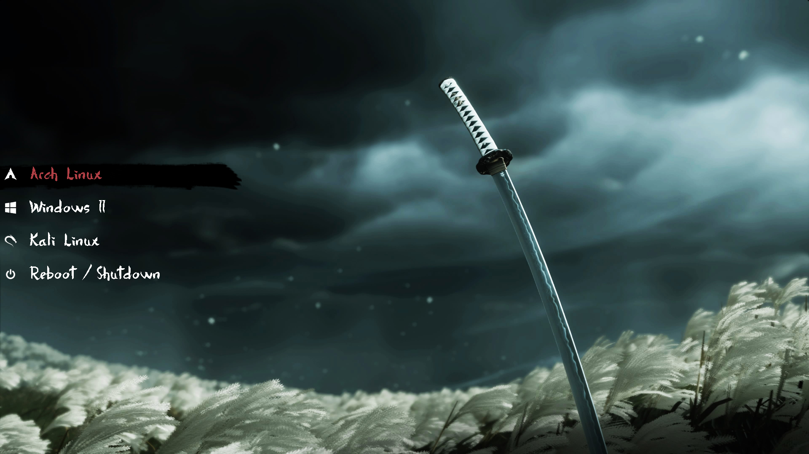

# grub-of-tsushima

A GRUB2 bootloader theme inspired by **Ghost of Tsushima** — featuring a moody samurai aesthetic with a katana wallpaper, brush stroke selection highlight, and calligraphic fonts.



---

## Details

| Property | Value |
|----------|-------|
| Resolution | 1920x1080 |
| Font | Dersu Uzala Brush |
| Terminal Font | Fira Code |
| Icon set | 90+ distros |

---

## Installation

1. Clone the repo or download the zip:
```bash
git clone https://github.com/ivanimmanuel-dev/grub-of-tsushima.git
```

2. Copy the theme folder to your GRUB themes directory:
```bash
sudo cp -r grub-of-tsushima /boot/grub/themes/
```

3. Edit your GRUB config:
```bash
sudo nano /etc/default/grub
```
Add or update this line:
```
GRUB_THEME="/boot/grub/themes/grub-of-tsushima/theme.txt"
```

4. Update GRUB:

**Arch / EndeavourOS / Manjaro:**
```bash
sudo grub-mkconfig -o /boot/grub/grub.cfg
```

**Ubuntu / Debian / Pop!_OS:**
```bash
sudo update-grub
```

**Fedora:**
```bash
sudo grub2-mkconfig -o /boot/grub2/grub.cfg
```

---

## Credits

- Base theme structure inspired by [sekiro_grub_theme](https://github.com/AbijithBalaji/sekiro_grub_theme) by [AbijithBalaji](https://github.com/AbijithBalaji) — MIT License
- Background artwork from Ghost of Tsushima, property of Sony Interactive Entertainment / Sucker Punch Productions — no ownership claimed
- Font: [Dersu Uzala Brush](https://www.fontspace.com/dersu-uzala-brush-font-f29alternativer) 
- Terminal font: [Fira Code](https://github.com/tonsky/FiraCode)

---

## License

MIT — see [LICENSE](LICENSE) for details.
